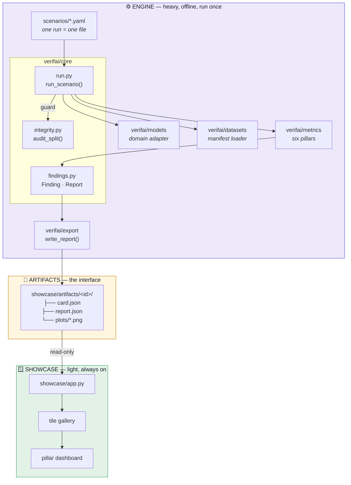
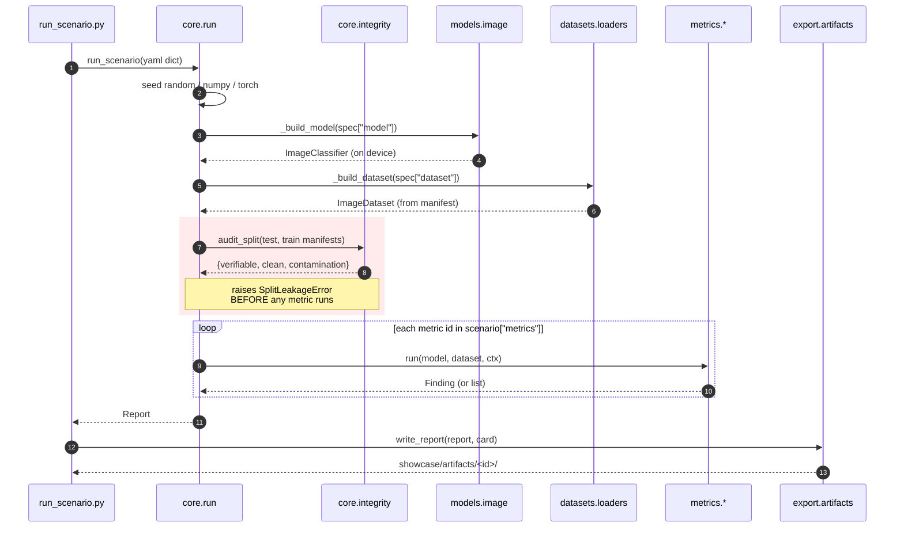
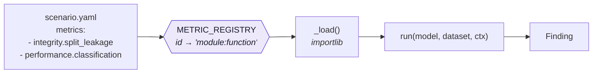

# Architecture overview

Two halves that never run at the same time, joined by a directory of files.

The split is deliberate and load-bearing. The engine needs torch, torchvision and a few
hundred MB of images; the showcase needs `streamlit`, `pillow` and `plotly`. Because the
showcase only ever *reads* precomputed files, it deploys to a free tier and stays online.

!!! warning "Keep the dependency files separate"
    `requirements-engine.txt` is heavy; `showcase/requirements.txt` is deliberately light.
    Streamlit Community Cloud resolves the dependency file in the **entrypoint's directory**
    before the repo root — which is the only thing stopping it from installing the torch
    dependencies declared in the root `pyproject.toml`.

## What runs when you evaluate

The guard runs **before** the metrics, not after. A contaminated split costs nothing to
detect and would otherwise produce a full report of flattering numbers.

## Module responsibilities

| Module | Owns | Must not |
|---|---|---|
| `core/findings.py` | `Finding`, `Report`, the pillar and verdict vocabularies | know about any specific metric |
| `core/run.py` | `METRIC_REGISTRY`, seeding, the integrity guard | import a metric directly |
| `core/integrity.py` | `audit_split()` — the one leakage implementation | be duplicated anywhere |
| `models/image.py` | `ImageClassifier`, device resolution, Grad-CAM layer lookup | hardcode a class list |
| `datasets/loaders.py` | manifest → `ImageDataset`, extra columns → `ImageSample.meta` | import from `verifai.models` |
| `metrics/**` | one `run(model, dataset, ctx) -> Finding` each | know the app exists |
| `export/artifacts.py` | `report.json` + `card.json` + `plots/` | compute anything |
| `showcase/app.py` | discovery and rendering | know any metric's name |

!!! note "One dependency direction that is asserted in tests"
    `datasets/loaders.py` once did `from verifai.models.image import CLASSES` — a dataset
    deriving its label vocabulary from a model. It now derives classes from its own labels,
    and `tests/test_engine_contracts.py` fails if that import ever returns.

## The registry

Metrics are referenced by string, resolved by import at run time. Nothing imports a metric
module directly, so a scenario picks its own subset and a new metric is one dictionary entry.

| Metric id | Implementation |
|---|---|
| `integrity.split_leakage` | `verifai.metrics.integrity.split_leakage:run` |
| `performance.classification` | `verifai.metrics.performance.classification:run` |
| `explainability.gradcam` | `verifai.metrics.explainability.gradcam:run` |
| `robustness.corruption` | `verifai.metrics.robustness.corruption:run` |
| `fairness.skin_tone` | `verifai.metrics.fairness.skin_tone_ita:run` |
| `privacy.mia` | `verifai.metrics.privacy.mia:run` |
