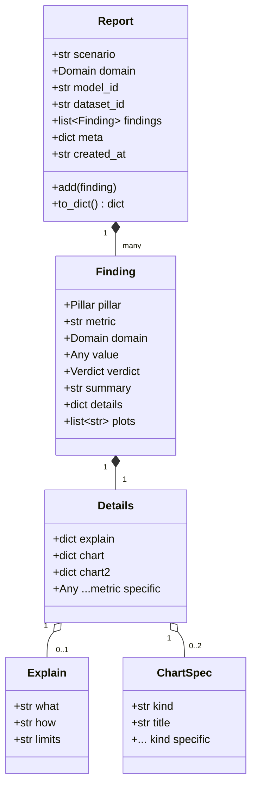
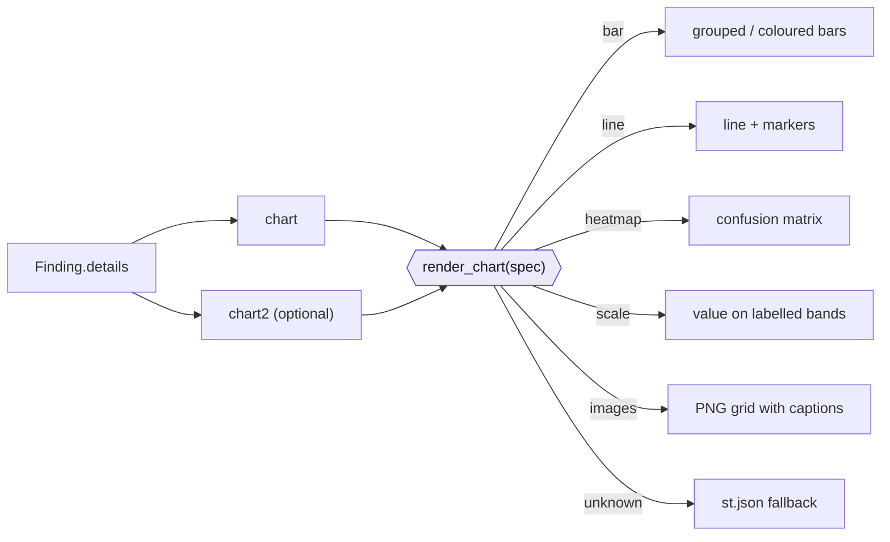
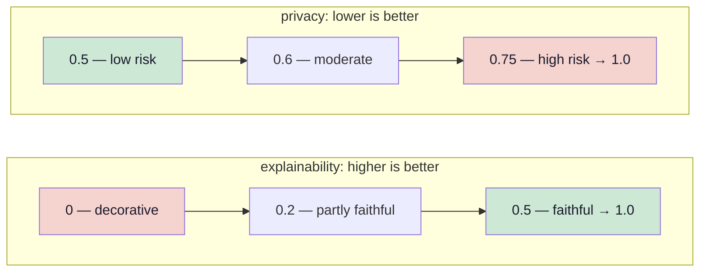
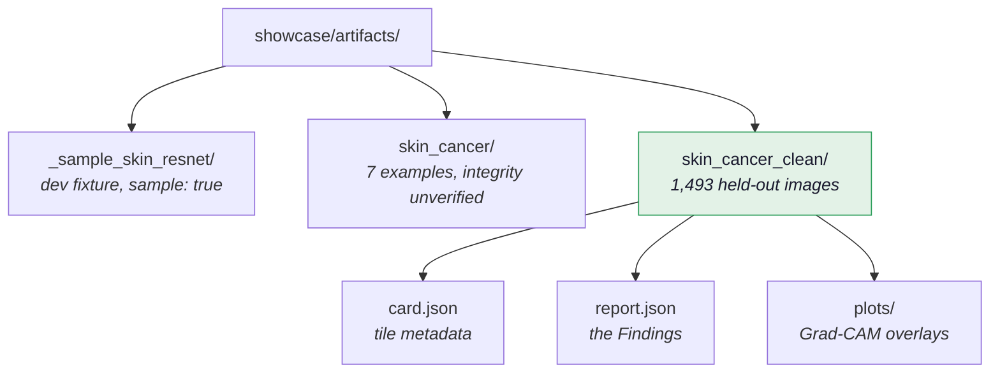

# Data model

One shape flows end to end: a metric returns a `Finding`, the runner collects them into a
`Report`, the exporter serialises it, and the app renders it. Nothing translates between
formats along the way.

## Vocabularies

`Pillar`
: `integrity` · `performance` · `fairness` · `robustness` · `explainability` · `privacy`

`Verdict`
: `pass` · `warn` · `fail` · `info`

`Domain`
: `image` · `text` · `tabular` · `llm`

!!! tip "`info` is not a weak `pass`"
    `info` means **no verdict was claimed** — the sample was too small, or the required data
    was missing. The dashboard renders it as "No verdict" rather than a neutral tick, because
    a reader must not mistake "we did not check" for "we checked and it was fine".

`Report.meta` records `seed`, `sample_size` (what was actually evaluated, not what the YAML
declared) and `device` — the last because results are bit-identical *per device*, not across
devices.

## The `explain` contract

Every metric ships its own explanatory text inside `details["explain"]`. This lives in the
engine, not the app, so a new metric brings its own wording and the app needs no change.

| Key | Answers | Rendered |
|---|---|---|
| `what` | What is measured, and why it matters | inline, always visible |
| `how` | How to read this particular chart | in the "How to read this chart" expander |
| `limits` | What this number does **not** tell you | same expander, under "What it does *not* tell you" |

`limits` is the one that earns its place. It is where each metric names the trap it sets:

> **Robustness** — "Stability is not correctness: a model that is confidently wrong both
> before and after a distortion scores a perfect 1.0 here."

> **Fairness** — "Coverage is not performance — this chart shows who is in the sample, not
> how well the model serves them."

> **Explainability** — "A convincing heatmap is not proof of medically correct reasoning —
> it shows where the model looked, not whether it looked for the right reason."

## Chart specifications

A metric describes a chart as data; `showcase/app.py::render_chart` draws it. Unknown kinds
fall back to `st.json`, so a malformed spec degrades rather than crashes.

| `kind` | Required keys | Used by |
|---|---|---|
| `bar` | `x`, `y` (+ `color`/`colors`, `hover`) | performance, robustness, fairness |
| `line` | `x`, `y` | — |
| `heatmap` | `z` (+ `x`, `y`, `text`, `zmin`, `zmax`) | performance at n > 50 |
| `scale` | `value`, `min`, `max`, `bands` | integrity, explainability, privacy |
| `images` | `paths` (+ `captions`) | explainability |

### Why `scale` replaced the dial gauge

A dial shows a number. A `scale` shows whether it is a *good* number, because the bands are
named and supplied by the metric — so each metric defines its own semantics. For deletion
faithfulness, higher is better; for membership-inference AUC, the green band sits on the left.

`kind: "gauge"` is still accepted as an alias that renders as a scale, so artifacts written
before the change keep rendering.

## Artifact layout

The app lists any directory containing **both** `card.json` and `report.json`. `card.json`
carries the tile metadata (`name`, `emoji`, `domain`, `dataset`, `description`, `hf_url`,
`sample`) and comes straight from the scenario's `card:` block.
