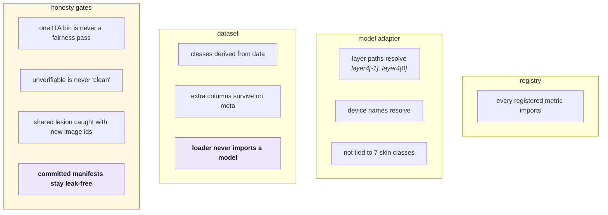

# Development

## Environment

The repo `.venv` holds both engine and showcase dependencies.

```bash
pip install -r requirements-engine.txt      # torch, torchvision, pillow, numpy, ...
pip install -r showcase/requirements.txt    # streamlit, pillow, plotly
pip install -r requirements-dev.txt         # pytest, mkdocs-material
pip install duckdb                          # only scripts/build_splits.py needs it
```

!!! warning "The two requirements files are separate on purpose"
    `showcase/requirements.txt` must stay light — Streamlit Community Cloud installs it, and
    it resolves the dependency file in the **entrypoint's directory** ahead of the repo root.
    That precedence is the only thing preventing the torch dependencies in the root
    `pyproject.toml` from being installed on the free tier.

## Commands

```bash
# evaluate a scenario -> showcase/artifacts/<name>/
.venv/bin/python scripts/run_scenario.py scenarios/skin_cancer.yaml

# view the showcase (reads precomputed artifacts only)
.venv/bin/streamlit run showcase/app.py

# tests: no network, no checkpoint, ~1.4s
.venv/bin/python -m pytest tests/ -q
.venv/bin/python -m pytest tests/test_engine_contracts.py::test_our_committed_manifests_are_leak_free -q

# these docs
.venv/bin/mkdocs serve        # http://127.0.0.1:8000
.venv/bin/mkdocs build        # -> site/
```

## Tests

`tests/test_engine_contracts.py` covers the seams rather than the numbers — the places that
broke, or could silently break, when the engine was generalised.



The honesty tests are regressions for bugs that actually shipped: a single populated ITA bin
scoring a green fairness `pass`, and an unverifiable split reporting as clean. Both were the
exact failure mode the project claims to prevent.

## Repository layout

```
verifai/            ENGINE
  core/             findings, runner + registry, split integrity
  models/           domain adapters (image: torchvision classifiers)
  datasets/         manifest-driven loaders
  metrics/          integrity · performance · fairness · robustness
                    explainability · privacy
  export/           Findings -> static artifacts

scripts/            build_splits · materialize_images · train_model
                    run_scenario · run_on_free_gpu.ipynb
scenarios/          one run = one YAML
data/
  manifests/        which images, which split  (in git)
  raw/              the pixels                 (gitignored)
  examples/         7 bundled HAM10000 images
showcase/
  app.py            gallery -> dashboard
  artifacts/<id>/   one folder = one tile
tests/              contract + honesty tests
docs/               this site
```

## Conventions

- **All user-facing text is English** — metric summaries, chart titles, axis labels, app copy.
- **Weights never go in git.** `*.pt` and `artifacts_training/` are ignored; checkpoints
  belong on the Hugging Face Hub.
- **Manifests do go in git.** They are small, and they are the provenance record.
- **Artifacts go in git.** They are the deployment.
- Commit style: explain *why*, and state what was measured rather than asserting it.

## Gotchas

| Symptom | Cause |
|---|---|
| `SplitLeakageError` on a new scenario | test manifest overlaps training — this is working correctly |
| Integrity reports `info`, not `pass` | manifests lack `image_id`/`lesion_id` to compare on |
| MPS slower than CPU | tiny run; ~206 ms setup dominates below ~30 forward passes |
| `num_workers>0` looks catastrophic | macOS spawn cost; needs `persistent_workers` and enough images to amortise |
| Robustness numbers moved | images re-materialised at a different `--max-size` |
| Chart renders as raw JSON | `kind` is not one of the five `render_chart` knows |
