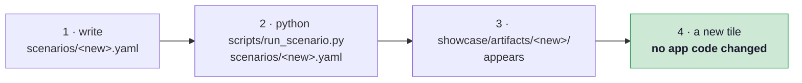
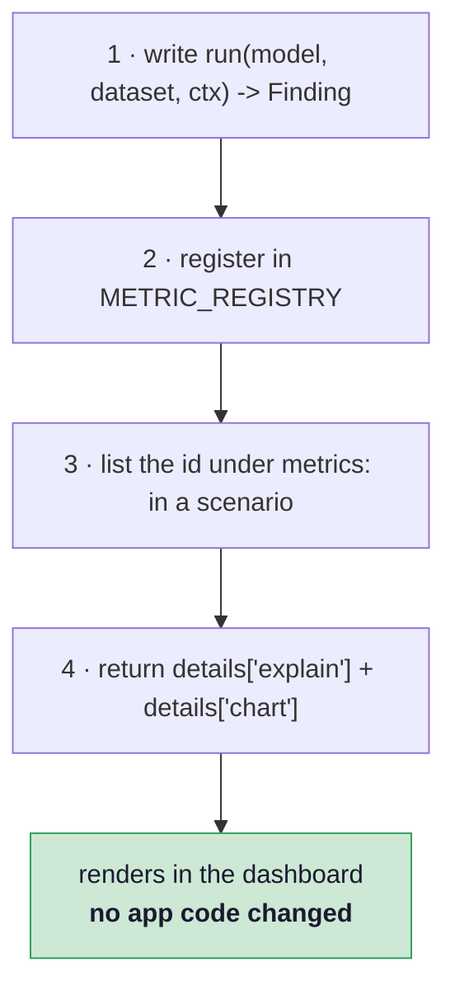

# Extending

Two extension paths, both designed so the Streamlit app never learns about your addition.

## Adding a model

A model is a scenario file. Run it, and a new tile appears.



```yaml
name: my_model
domain: image
seed: 42

model:
  loader: "verifai.models.image:load"
  id: "my-model"
  arch: "resnet18"              # any torchvision classifier factory
  cam_layer: "layer4[-1]"       # Grad-CAM target; defaults per arch
  device: "auto"                # auto | cpu | cuda | mps
  weights_path: "artifacts_training/my_model.pt"
  # ...or repo_id + filename to pull from the Hugging Face Hub
  classes: [...]                # MUST match the checkpoint's output order

dataset:
  loader: "verifai.datasets.loaders:load_image_manifest"
  id: "my-test-set"
  manifest: "data/manifests/my_test.csv"
  images_dir: "data/raw/my_images"

card:                            # copied verbatim into card.json
  name: "My Model"
  emoji: "🧠"
  description: "..."

metrics:
  - "integrity.split_leakage"
  - "performance.classification"
```

!!! warning "`classes` is the checkpoint's order, not alphabetical convenience"
    The list must match the order the model's output layer was trained with. Datasets derive
    their class list from their own labels; models declare theirs. Getting this wrong
    produces confident, plausible, wrong predictions rather than an error.

Supported architectures are anything in `torchvision.models` with an `fc` head (ResNet
family) or a `classifier` head (DenseNet, EfficientNet, MobileNet). `DEFAULT_CAM_LAYER` maps
common families to a sensible Grad-CAM target.

## Adding a metric



```python
from verifai.core.findings import Finding

def run(model, dataset, ctx) -> Finding:
    n = len(dataset)
    score = ...                       # your measurement

    # Do not claim a verdict the sample cannot support.
    verdict = "info"
    if n >= 30:
        verdict = "pass" if score >= 0.8 else "warn"

    return Finding(
        pillar="performance", metric="my_metric", domain="image",
        value={"score": score, "n": n},
        verdict=verdict,
        summary=f"Score {score:.2f} on {n} images." +
                ("" if n >= 30 else f" Small sample (n={n}) — not a benchmark."),
        details={
            "explain": {
                "what": "What this measures, and why it matters.",
                "how": "How to read this chart.",
                "limits": "What this number does NOT tell you.",
            },
            "chart": {"kind": "bar", "title": "...", "x": [...], "y": [...]},
        },
    )
```

Then one line in `verifai/core/run.py`:

```python
METRIC_REGISTRY = {
    ...,
    "performance.my_metric": "verifai.metrics.performance.my_metric:run",
}
```

### What `ctx` carries

| Key | Contents |
|---|---|
| `scenario` | the whole parsed YAML — read your own config block from here |
| `seed` | the run's seed, for anything stochastic |
| `plot_dir` | where to write PNGs; reference them as `plots/<name>.png` |

Paths in `Finding.plots` and in `images` chart specs are relative to the artifact folder.

## The rules a new metric must follow

These are not style preferences — they are what the project is for.

!!! danger "Never invent a number"
    A metric that cannot be computed returns `None` and explains why, as
    `privacy/mia.py` does when no members set is declared. It does not return a
    placeholder, and it does not quietly skip.

!!! warning "Gate the verdict on the evidence"
    Stay at `info` until the sample supports a claim. Existing gates: `n>=30` for accuracy,
    `n>=20` for robustness, two populated bins of `>=10` for a fairness gap, 50 per side for
    membership inference. State `n` in the summary.

!!! note "Unverifiable is not clean"
    If the check could not run, say so. Reporting "no problem found" when nothing was
    examined is the failure mode this project exists to catch — and it has already occurred
    twice in this codebase, both times caught by a test that now guards it.

Write `explain` for a reader who has never seen a Responsible-AI report. Plots alone do not
communicate.

## Adding a chart kind

Prefer reusing `bar`, `line`, `heatmap`, `scale` or `images`. A new kind means editing
`render_chart` in `showcase/app.py`, which is the one place the app and the engine are
coupled — and every existing artifact must keep rendering afterwards.
