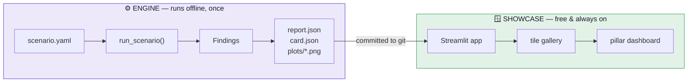
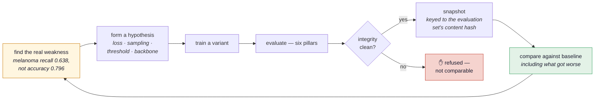

# VERIFAI Showcase

**Systematic, reproducible Responsible-AI evaluation of ML models** across six pillars —
integrity, performance, fairness, robustness, explainability and privacy.

The evaluation runs *once*, offline, and produces static artifacts. A small Streamlit app
reads those files and renders them. No server, no database, no running costs.

## Why this exists

A single accuracy number is not an evaluation. This model reports **79.6% top-1 accuracy**
on held-out data — and misses **one melanoma in three**. Both facts come from the same run;
only one of them fits in a headline.

!!! danger "The failure that motivated the integrity pillar"
    The dataset this project started from shipped `train`/`validation`/`test` splits in which
    **80% of the test images also appeared in training**. Every accuracy computed on it was a
    memorisation check wearing a benchmark's clothes. Nothing crashed; the number just came
    out high. See [Split integrity](integrity.md).

## The loop it is built for

Auditing a model once is the small use. The point is the cycle: the framework finds the
weakness that the headline number hides, you act on it, and the next run is compared against
the last one — but only when the comparison is legitimate.

Every run writes a snapshot to `history/`, so an experiment cannot silently overwrite the
evidence of the one before it. Runs are grouped by the **content hash** of the evaluation
manifest rather than its filename, and any run whose split was contaminated — or never
checked — is excluded from the chart with the reason stated. A green *+12 points* against a
leaked baseline is exactly the claim this project exists to catch.

## The design in three claims

=== "Results are files"

    An evaluation produces `report.json`, `card.json` and some PNGs in a folder. Adding a
    folder adds a tile to the showcase. There is no database and no backend, so the public
    demo costs nothing to keep online and every result is reviewable in a diff.

=== "Honesty is enforced, not intended"

    Metrics withhold a verdict until the sample justifies one (`n>=30` for accuracy, `n>=20`
    for robustness, two populated bins of `>=10` for a fairness gap). A metric that cannot be
    computed says so instead of returning a number. The runner refuses to evaluate a
    contaminated split at all.

=== "Adding a model changes no code"

    A model is a scenario YAML. Run it, get a folder, get a tile. A new metric supplies its
    own chart specification and its own explanatory text, so the app never learns about it.

## Where to start

| If you want to… | Read |
|---|---|
| Understand how the parts fit together | [Architecture overview](architecture.md) |
| Know what a `Finding` is | [Data model](data-model.md) |
| Run the whole thing yourself | [The pipeline](pipeline.md) |
| Know what is actually measured | [The six pillars](pillars.md) |
| Understand the leakage story | [Split integrity](integrity.md) |
| See the numbers | [Current results](results.md) |
| Add a model or a metric | [Extending](extending.md) |
