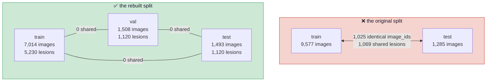
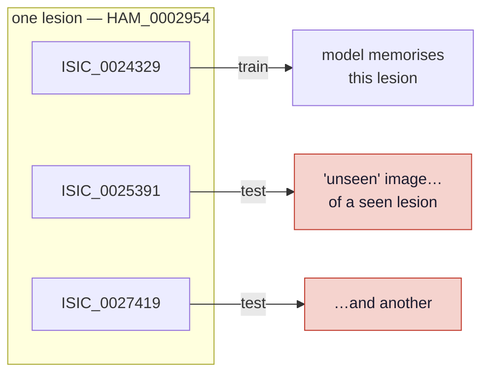
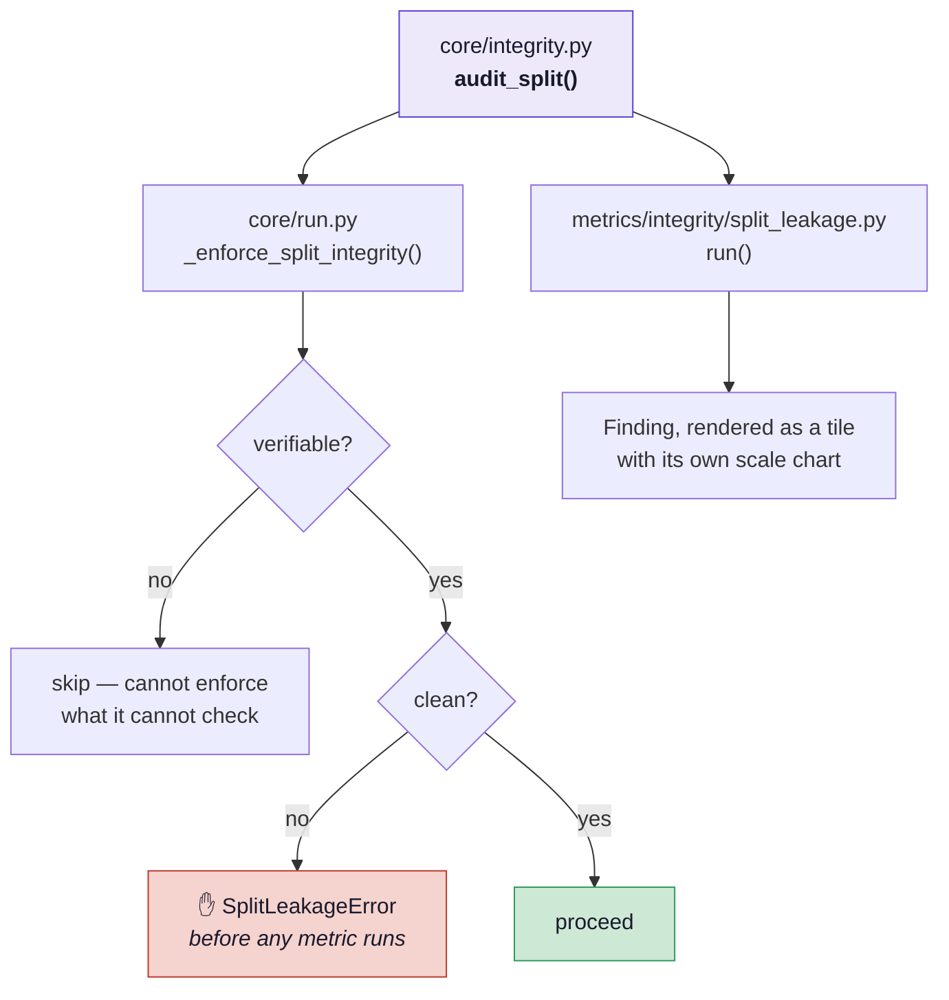
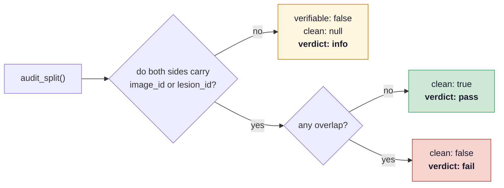

# Split integrity

The pillar that exists because this project's own starting point failed it.

## What went wrong

The `skin-lesion-resnet18` checkpoint was trained on the Hugging Face dataset
`marmal88/skin_cancer`, which ships `train`, `validation` and `test` splits. That sounds
like exactly what you want. It is not: the splits overlap.

Queried directly from the dataset's parquet metadata:

| Check | Result |
|---|---|
| Its `test` split | 1,285 images |
| Test images whose **`image_id` also appears in `train`** | **1,025 (80%)** |
| Test images whose **lesion** was seen in training | 1,132 (88%) |
| Test images left after excluding train lesions | 153 |
| …after excluding train **and** validation lesions | **28** |
| HAM10000 images covered by `train` + `validation` | **9,964 of 10,015 (99.5%)** |
| HAM10000 lesions covered by `train` + `validation` | **7,442 of 7,470 (99.6%)** |



Nothing crashed. The number simply came out high.

!!! danger "More data would have made it worse"
    The intuitive fix — "evaluate on the whole test set instead of 7 images" — makes the
    result *less* trustworthy, not more. A leaked n=1,285 carrying a green `pass` is worse
    than an honest n=7 labelled "not a benchmark".

## Why `lesion_id`, not `image_id`

HAM10000 photographs the same lesion repeatedly. A split that only deduplicates images still
puts a *second photograph of a memorised lesion* in the test set, which is not a fair
question to ask the model.



This is why `audit_split()` reports two numbers: `shared_ids` (literally the same image, the
blunt failure) and `shared_groups` (the same lesion, the subtle one).

## How it is enforced

One implementation, two consumers — so the guard and the published report can never disagree.



```yaml
integrity:
  enforce: true          # false downgrades the stop to a reported finding
  group_key: "lesion_id"
  id_key: "image_id"
  # train_manifests: [...]   # otherwise derived from the training: block
```

When not given explicitly, the manifests to check against are derived from the `training:`
block — **including validation**, because the model was selected on it.

## Verifiable is not the same as clean

A second honesty bug, found while wiring this metric into the 7-image scenario: manifests
carrying only `filename` and `label` have nothing to compare, so the audit found zero
overlap and reported a green **"clean split"** — publishing an unverified split as a verified
one.



The unverifiable case says so plainly:

> Split integrity could not be verified: the manifests carry no shared identifier to compare
> on. This is not a clean bill of health — it means the question was never answered, so every
> number in this report rests on the assumption that the model never saw this data.

That is the honest status of the original `skin_cancer` tile, whose checkpoint trained on
~99.5% of HAM10000.

## Which pillars leakage actually invalidates

Not all of them, which is worth knowing when a split turns out to be dirty:

| Pillar | Affected? |
|---|---|
| Performance, subgroup accuracy | **Yes** — recall masquerading as generalisation |
| Privacy | **Yes**, and worst hit — with 99.5% of data in training there is barely a non-member set |
| Robustness | No — whether a prediction *flips* is a property of the model |
| Fairness coverage | No — describes the dataset, not generalisation |
| Explainability | No — illustrative either way |

## Tests

`tests/test_engine_contracts.py` covers a disjoint split passing, a shared lesion with
*distinct* image ids being caught, identical images being caught, unverifiable never reading
as clean, and — most importantly — that **the committed manifests are still leak-free**.
If that last one ever fails, do not publish a number.
