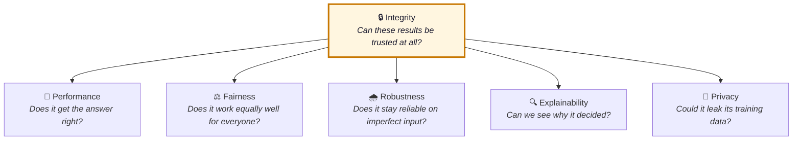
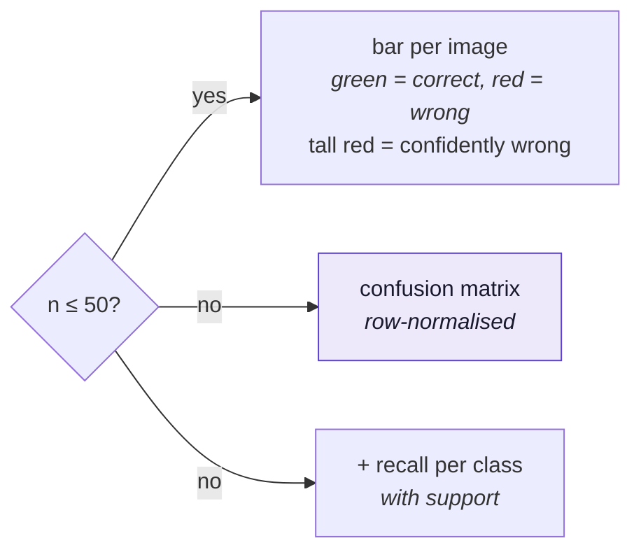
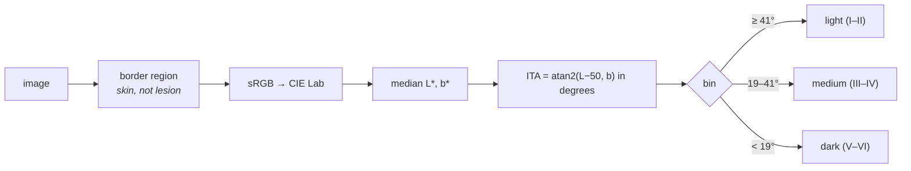
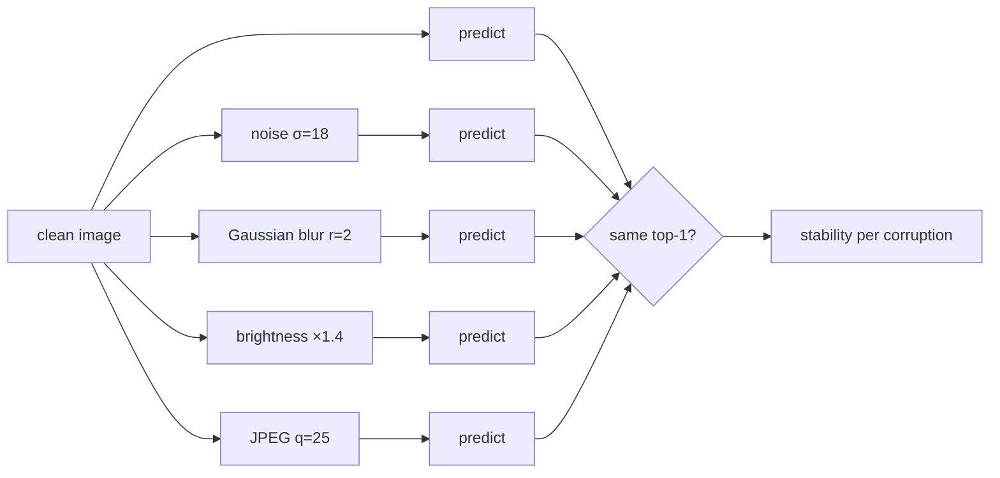
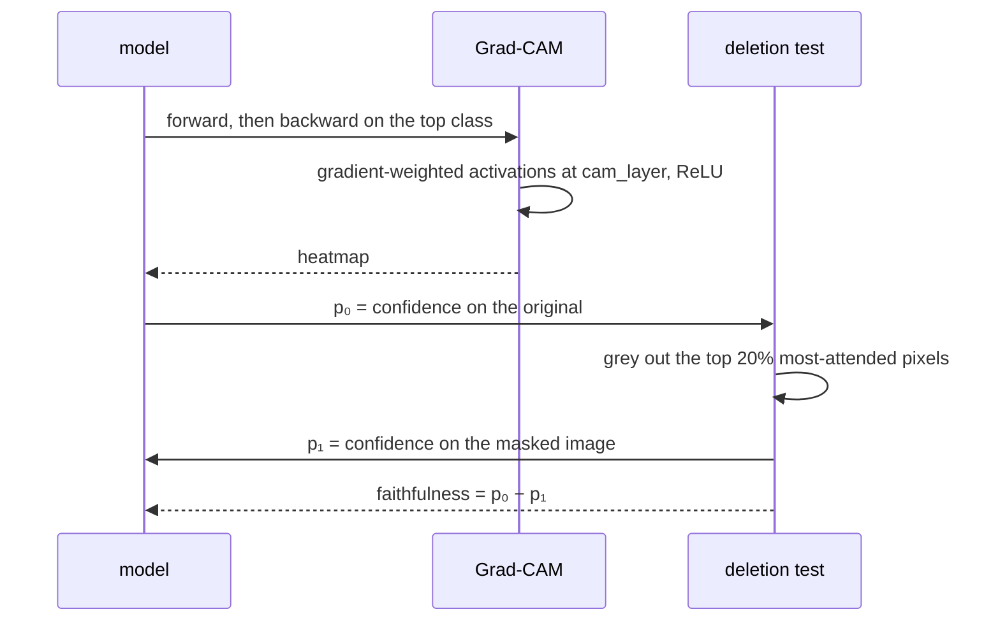
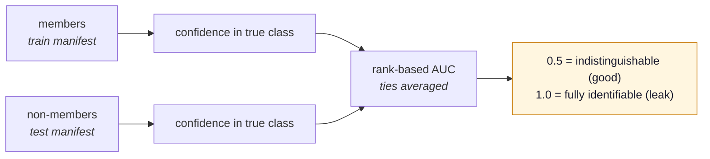

# The six pillars

!!! tip "Unfamiliar terms?"
    Sensitivity, PPV, confidence intervals, ITA and the rest are defined in plain
    language with worked examples in the [Glossary](glossary.md).

Each pillar answers one plain question. The dashboard shows them in this order because
**integrity comes first** — every other number is conditional on it.

| Pillar | Metric | Needs held-out data? |
|---|---|---|
| Integrity | `split_leakage` | — it *is* the check |
| Performance | `top1_accuracy` | **yes** — this is what leakage corrupts |
| Fairness | `skin_tone_ita` | yes for subgroup accuracy, no for coverage |
| Robustness | `corruption_stability` | no — measures whether predictions *flip* |
| Explainability | `gradcam_faithfulness` | no — illustrative either way |
| Privacy | `membership_inference_auc` | **yes**, and needs members too |

## Integrity — `split_leakage`

Compares the evaluation manifest against everything the model trained on, by `lesion_id` as
well as `image_id`. Covered in full in [Split integrity](integrity.md).

Reports `pass` when nothing is shared, `fail` above 1% contamination, `warn` below it, and
`info` when the manifests carry no identifier to compare on — which is **not** a clean bill
of health, merely an unanswered question.

## Performance — `top1_accuracy`

Share of images whose most confident class is correct. The representation switches with
sample size, because one bar per image is useless at scale:

`value` carries `accuracy`, `balanced_accuracy`, `per_class_recall` and `support`.

!!! danger "Why the per-class view is not optional"
    This model scores **79.6% accuracy** and **63.8% recall on melanoma**. The averaged
    number is dominated by the 1,009 nevi in the test set. A rare, dangerous class can fail
    badly without moving the headline at all.

Verdict gate: no pass/fail below **n = 30**.

## Fairness — `skin_tone_ita`

HAM10000 carries no skin-type labels, so skin tone is estimated from the image itself. The
Individual Typology Angle is computed from the healthy skin *around* the lesion — the outer
frame of a dermatoscopic crop — using the median to resist hair, rulers and vignetting.

Two things are reported: **coverage** (who is in the sample) and, only when the evidence
supports it, **subgroup accuracy** and the gap between groups.

Verdict gate: a gap requires **at least two populated bins with ≥ 10 images each**.

!!! warning "A regression worth remembering"
    The gate originally accepted a single populated bin. One group yields a gap of 0.0, which
    scored a green `pass` — on a dataset whose defining fairness problem is that it barely
    contains dark skin. A test now asserts that a single bin never reads as a pass.

## Robustness — `corruption_stability`

Applies four distortions that should not change a diagnosis, and measures how often the top-1
class survives.

Verdict gate: no pass/fail below **n = 20**.

!!! note "Stability is not correctness"
    A model that is confidently wrong both before and after a distortion scores a perfect
    1.0 here. Read it next to performance, never alone.

## Explainability — `gradcam_faithfulness`

Grad-CAM highlights the regions that drove the decision. Faithfulness then checks whether
those highlights are honest, by masking the most-attended region and measuring the drop in
the predicted class's probability.

The target layer comes from `model.cam_layer` (`layer4[-1]` for ResNets), so this is not
tied to one architecture. Overlays are capped at `gradcam_max_images` (default 7) to keep
artifacts small.

Always `info` — there is no defensible universal threshold for "faithful enough".

## Privacy — `membership_inference_auc`

Asks whether an attacker could tell that a specific patient was in the training set, using
the model's confidence in the true class as the signal.

Verdict: `pass` below 0.60, `warn` below 0.75, `fail` above. Refuses to report below 50
images per side, and refuses entirely when no members set is declared.

!!! note "One attack, not all attacks"
    This is the cheap confidence-only attack. Shadow models or per-class calibration can do
    better, so a low score is evidence of low risk rather than a guarantee.
