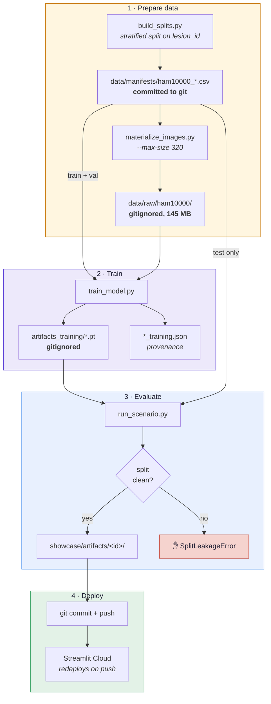
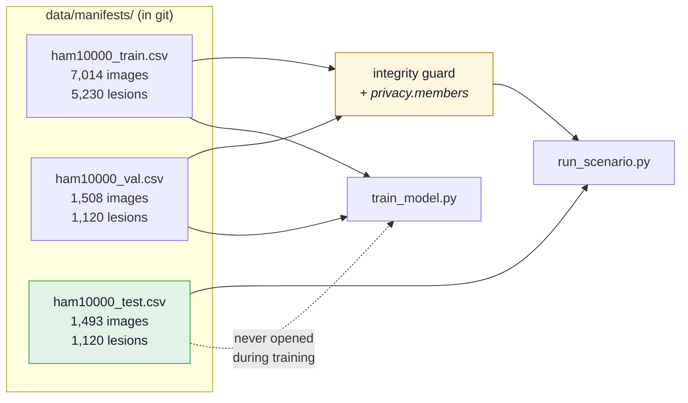
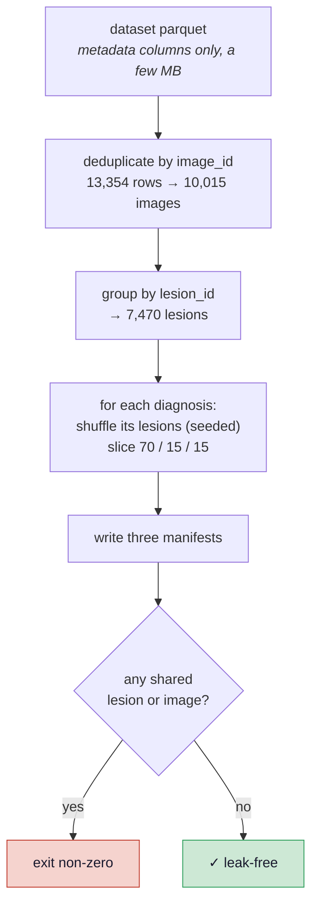
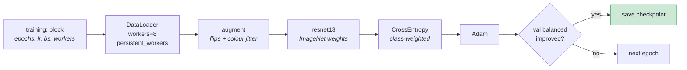

# The pipeline

Everything runs locally. The full sequence from raw dataset to a deployed dashboard is about
fifteen minutes on an Apple M1 Max, most of it waiting for images to download.



```bash
python scripts/build_splits.py                                   # manifests (already committed)
python scripts/materialize_images.py --max-size 320              # 145 MB
python scripts/train_model.py scenarios/skin_cancer_clean.yaml   # ~4.6 min on MPS
python scripts/run_scenario.py scenarios/skin_cancer_clean.yaml  # ~1:49
git add showcase/artifacts && git commit && git push             # push == deploy
```

## The manifests are the contract

This is the idea the whole pipeline is built around. Training reads `_train.csv` and
`_val.csv`; evaluation reads `_test.csv`; both are versioned in git. "What did the model see"
stops being a matter of trust and becomes a file you can diff.



Each row carries `filename, image_id, lesion_id, label, dx_type, age, sex, localization`.
Columns beyond `filename` and `label` land on `ImageSample.meta`, which is what makes real
demographic subgroups possible rather than only the ITA pixel proxy.

## Step 1 — building the split

HAM10000 photographs the same lesion more than once, so splitting on rows leaks even when
every `image_id` is unique. Splitting on `lesion_id` is what makes the test set meaningful.

Every lesion carries exactly one diagnosis — verified against the data — so the split can be
**stratified as well as grouped**, which `GroupShuffleSplit` cannot do.



!!! tip "Metadata-only reads"
    `build_splits.py` reads just the metadata columns over HTTP range requests — a few MB
    instead of the 3.6 GB the embedded images would cost. The image bytes are only fetched
    later, by `materialize_images.py`.

## Step 2 — materialising images

| Option | Disk for 10,015 images |
|---|---|
| originals (600×450) | 2.70 GB |
| `--max-size 320` | **0.14 GB** (19× smaller) |
| `--max-size 256` | 0.10 GB |

The model resizes to 224×224 as its first transform, so 320 loses nothing for training.

!!! warning "Keep one resolution across anything you compare"
    A blur radius or a JPEG quality means something different at a different resolution, so
    **corruption stability shifts** with `--max-size`. The choice is recorded in
    `_materialize.json` beside the images, and the script refuses to write into a directory
    that already holds a different resolution.

## Step 3 — training

`train_model.py` reads the scenario's `training:` block, trains on train, selects on
**balanced** accuracy against val, and never opens the test manifest.



Two choices worth knowing:

**Class weights.** 67% of this data is `melanocytic_Nevi`. Unweighted cross-entropy learns
to say "nevi" and scores well doing it.

**Selection on balanced accuracy**, not accuracy, for the same reason — the run's best plain
accuracy (0.807, epoch 11) was *not* the checkpoint kept.

## Step 4 — evaluation and deploy

`run_scenario.py` builds the model and dataset, runs the integrity guard, then each metric in
the scenario's `metrics:` list, and writes the artifact folder. Because the showcase reads
committed files, **pushing is deploying** — Streamlit Community Cloud redeploys on push.

## Measured performance

On an Apple M1 Max (10 cores, 64 GB):

| Stage | Throughput | Time |
|---|---|---|
| ResNet18 fwd+bwd, MPS, bs=32 | 348 img/s | ~20 s/epoch |
| Decode + augment, 8 workers, 320px | 1,259 img/s | ~6 s/epoch |
| Realistic epoch (7,014 images) | 286 img/s | 24.5 s |
| **Full 12-epoch training** | | **4.6 min** |
| **Evaluation of 1,493 images** | | **1:49** |

Data loading is ~3.5× faster than the GPU consumes, so training is correctly compute-bound.

!!! note "MPS pays for itself after ~30 forward passes"
    MPS costs ~206 ms of one-time setup, then runs at 2.8 ms/img against CPU's 9.8. A
    scenario reaches break-even at about five images, since each costs ~7 passes. That is why
    `skin_cancer.yaml` (n=7) is pinned to `cpu` while `skin_cancer_clean.yaml` (n=1,493) uses
    `auto`. No cloud GPU is needed anywhere in this pipeline.
