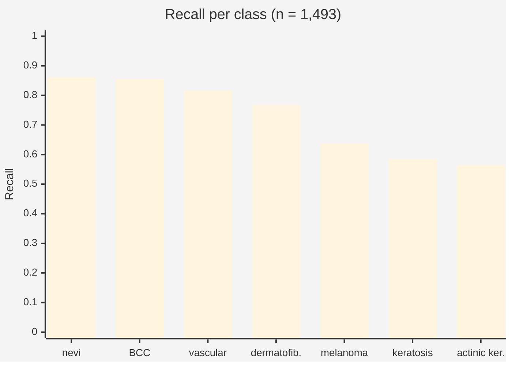

# Current results

`skin_cancer_clean` — ResNet18 trained on a lesion-grouped split of HAM10000 and evaluated
on **1,493 images the model provably never saw**. First run in this project where every
verdict gate is active, so the first whose verdicts claim anything.

## Summary

| Pillar | Verdict | Result |
|---|---|---|
| Integrity | :material-check: **pass** | 0 shared lesions, 0 shared images across 1,493 test images |
| Performance | :material-check: **pass** | 79.6% top-1, 72.8% balanced |
| Privacy | :material-check: **pass** | membership-inference AUC 0.558 (0.5 = ideal) |
| Robustness | :material-alert: **warn** | 71.7% of predictions survive corruption |
| Fairness | :material-close: **fail** | 21.3-point accuracy gap across ITA skin-tone bins |

## What the headline number hides



| Class | Recall | Support |
|---|---:|---:|
| melanocytic_Nevi | 0.862 | 1,009 |
| basal_cell_carcinoma | 0.855 | 76 |
| vascular_lesions | 0.818 | 22 |
| dermatofibroma | 0.769 | 13 |
| **melanoma** | **0.638** | 163 |
| benign_keratosis-like_lesions | 0.586 | 157 |
| actinic_keratoses | 0.566 | 53 |

!!! danger "80% accuracy, and it misses one melanoma in three"
    The clinically most important class is the second worst performer. The headline is
    dominated by the 1,009 nevi — 68% of the test set. This is the entire argument for
    per-class reporting, and for the balanced accuracy (72.8%) that sits seven points below
    the plain figure.

## Fairness

| ITA bin | Accuracy | Images |
|---|---:|---:|
| light (I–II) | 78.5% | 1,325 |
| medium (III–IV) | 96.3% | 108 |
| dark (V–VI) | 75.0% | 60 |

The 21.3-point gap exceeds the 15-point `fail` threshold. Read the supports before drawing a
conclusion, though: the gap is driven as much by the small medium-skin bin scoring unusually
*high* as by dark skin scoring low. The honest summary is that **89% of the test set is one
skin-tone bin**, which is HAM10000's documented skew, and the other two bins are small enough
that their percentages are noisy.

## Robustness

| Corruption | Predictions unchanged |
|---|---:|
| brightness ×1.4 | 77.6% |
| JPEG q=25 | 73.8% |
| Gaussian blur r=2 | 71.7% |
| noise σ=18 | 63.8% |

Mean 71.7%, below the 85% `pass` threshold. Roughly one prediction in three flips under
noise that does not change the diagnosis.

## Privacy

Membership-inference AUC **0.5577** from 750 training and 750 held-out images. Mean
confidence in the true class was **0.873** on training images against **0.777** on unseen
ones — a real but small separation, landing in the "low risk" band.

## Explainability

Mean deletion faithfulness **0.45** over 7 Grad-CAM overlays: masking the highlighted region
costs the predicted class 45 percentage points of confidence on average, which puts it in
the "partly faithful" band. Reported as `info` — there is no defensible universal threshold
for "faithful enough", and 7 overlays is an illustration rather than a measurement.

## Training run

12 epochs, 4.6 minutes on MPS, batch size 32, lr 1e-4, class-weighted cross-entropy.

| Epoch | Train loss | Val accuracy | Val balanced |
|---:|---:|---:|---:|
| 1 | 1.081 | 0.670 | 0.652 |
| 4 | 0.462 | 0.737 | 0.708 |
| 8 | 0.303 | 0.755 | 0.707 |
| 11 | 0.188 | **0.807** | 0.698 |
| 12 | 0.213 | 0.792 | **0.724** ← kept |

!!! note "Why epoch 12 and not epoch 11"
    Epoch 11 had the best plain accuracy. Selection runs on **balanced** accuracy, because on
    a set that is 67% nevi, plain accuracy rewards a model for ignoring the rare classes.

## Reproducing

```bash
python scripts/materialize_images.py --max-size 320
python scripts/train_model.py scenarios/skin_cancer_clean.yaml
python scripts/run_scenario.py scenarios/skin_cancer_clean.yaml
```

Seed 42 throughout; the split manifests are committed. Results are bit-identical per device
but not across devices — `report.json` records `meta.device` for that reason.
